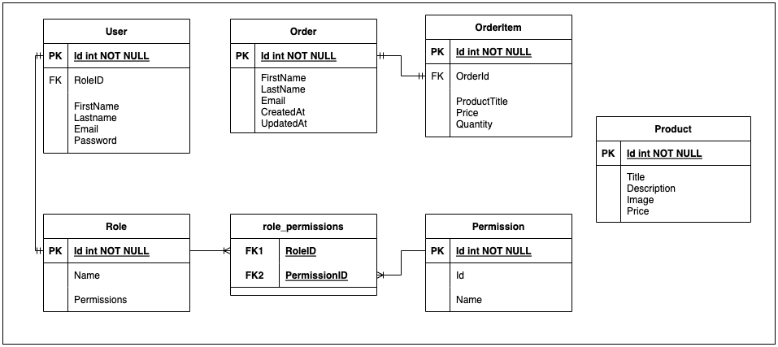

# Go Admin App
A simple backend app/API that lets you create/manage users, products and their orders. Source code is based on [this Udemy course](https://udemy.com/course/the-complete-react-golang-course). The server runs on port 3000 and depends on a MySQL database.

# How to Run?
* Directly
  ```sh
  export GO111MODULE=on
  go run main.go
  ```
* With [Realize](https://github.com/oxequa/realize)
  ```sh
  export GO111MODULE=on
  realize start
  ```

# Resources
* [PostmanAPICollection](./GoAdmin.postman_collection.json)
  - The collection of Postman API calls for testing/configuring.
# Code Structure
## [controllers](./controllers)
This directory contains the codes that handle all operations on specific database models

### [authController](./controllers/authController.go)
<table>
<tr>
    <th>Function</th>
    <th class="description">Description</th>
    <th>API Endpoint</th>
    <th>Method</th>
    <th>Body/Params</th>
</tr>

<!-- Data Begins -->
<tr>
    <td class="function">Register</td>
    <td class="description">Registers a new user</td>
    <td class="api-endpoint"><code>/api/register</code></td>
    <td class="method"><code>POST</code></td>
    <td class="body-params">
    <pre class="body-params">
    json
    {
        "first_name": "Harry",
        "last_name": "Potter",
        "email": "hjp@hogwarts.edu",
        "password": "patronus",
        "password_confirm": "patronus"
    }
    </pre>
    </td>
</tr>
<tr>
    <td class="function">Login</td>
    <td class="description">
    Logs in a user</br>
    Set a JWT token in the cookie.
    </td>
    <td class="api-endpoint"><code>/api/login</code></td>
    <td class="method"><code>POST</code></td>
    <td class="body-params">
    <pre class="body-params">
    json
    {
        "email": "hjp@hogwarts.edu",
        "password": "patronus",
    }
    </pre>
    </td>
</tr>
<tr>
    <td class="function">User</td>
    <td class="description">Get the logged-in user's info (except password)</td>
    <td class="api-endpoint"><code>/api/user</code></td>
    <td class="method"><code>GET</code></td>
    <td class="body-params">
    <pre></pre>
    </td>
</tr>
<tr>
    <td class="function">Logout</td>
    <td class="description">
    Logs out the logged-in user</br>
    Removes the JWT token cookie.
    </td>
    <td class="api-endpoint"><code>/api/logout</code></td>
    <td class="method"><code>POST</code></td>
    <td class="body-params">
    <pre></pre>
    </td>
</tr>
<tr>
    <td class="function">UpdateInfo</td>
    <td class="description">Updates the logged-in user's info (except password)</td>
    <td class="api-endpoint"><code>/api/users/info</code></td>
    <td class="method"><code>PUT</code></td>
    <td class="body-params">
    <pre class="body-params">
    json
    {
        "first_name": "Harry",
        "last_name": "Potter",
        "email": "hjp@hogwarts.edu",
    }
    </pre>
    </td>
</tr>
<tr>
    <td class="function">UpdatePassword</td>
    <td class="description">Updates the password for the logged-in user</td>
    <td class="api-endpoint"><code>/api/users/password</code></td>
    <td class="method"><code>PUT</code></td>
    <td class="body-params">
    <pre class="body-params">
    json
    {
        "password": "crucio",
        "password_confirm": "crucio"
    }
    </pre>
    </td>
</tr>
<!-- Data Ends -->
</table>

### [imageController](./controllers/imageController.go)
<table>
<tr>
    <th>Function</th>
    <th class="description">Description</th>
    <th>API Endpoint</th>
    <th>Method</th>
    <th>Body/Params</th>
</tr>

<!-- Data Begins -->
<tr>
    <td class="function">Upload</td>
    <td class="description">Uploads an image to <code>uploads</code> directory</td>
    <td class="api-endpoint"><code>/api/upload</code></td>
    <td class="method"><code>POST</code></td>
    <td class="body-params">
    <pre class="body-params">
    form-data
    {
        "image": "file_blob"
    }
    </pre>
    </td>
</tr>
<!-- Data Ends -->
</table>

### [orderController](./controllers/orderController.go)
<table>
<tr>
    <th>Function</th>
    <th class="description">Description</th>
    <th>API Endpoint</th>
    <th>Method</th>
    <th>Body/Params</th>
</tr>

<!-- Data Begins -->
<tr>
    <td class="function">AllOrders</td>
    <td class="description">Gets all orders in the DB, and paginates the result</td>
    <td class="api-endpoint"><code>/api/orders</code></td>
    <td class="method"><code>GET</code></td>
    <td class="body-params">
    <pre></pre>
    </td>
</tr>
<tr>
    <td class="function">Export</td>
    <td class="description">Exports orders into a CSV file in <code>csv/orders.csv</code></td>
    <td class="api-endpoint"><code>/api/export</code></td>
    <td class="method"><code>POST</code></td>
    <td class="body-params">
    <pre></pre>
    </td>
</tr>
<tr>
    <td class="function">Chart</td>
    <td class="description">Returns per-day orders</td>
    <td class="api-endpoint"><code>/api/chart</code></td>
    <td class="method"><code>GET</code></td>
    <td class="body-params">
    <pre></pre>
    </td>
</tr>
<!-- Data Ends -->
</table>

### [permissionController](./controllers/permissionController.go)

<table>
<tr>
    <th>Function</th>
    <th class="description">Description</th>
    <th>API Endpoint</th>
    <th>Method</th>
    <th>Body/Params</th>
</tr>

<!-- Data Begins -->
<tr>
    <td class="function">AllPermissions</td>
    <td class="description">Get all permission types from DB</td>
    <td class="api-endpoint"><code>/api/permissions</code></td>
    <td class="method"><code>GET</code></td>
    <td class="body-params">
    <pre></pre>
    </td>
</tr>
<!-- Data Ends -->
</table>

### [productController](./controllers/productController.go)

<table>
<tr>
    <th>Function</th>
    <th class="description">Description</th>
    <th>API Endpoint</th>
    <th>Method</th>
    <th>Body/Params</th>
</tr>

<!-- Data Begins -->
<tr>
    <td class="function">AllProducts</td>
    <td class="description">Get all the products from DB, and paginate result</td>
    <td class="api-endpoint"><code>/api/products</code></td>
    <td class="method"><code>GET</code></td>
    <td class="body-params">
    <pre></pre>
    </td>
</tr>
<tr>
    <td class="function">CreateProduct</td>
    <td class="description">Create a Product in DB.</td>
    <td class="api-endpoint"><code>/api/products</code></td>
    <td class="method"><code>POST</code></td>
    <td class="body-params">
    <pre class="body-params">
    json
    {
        "title": "Wand",
        "description": "MX1000",
        "image": "not found",
        "price": 1000
    }
    </pre>
    </td>
</tr>
<tr>
    <td class="function">GetProduct</td>
    <td class="description">Get the product with specified id</td>
    <td class="api-endpoint"><code>/api/products/{id}</code></td>
    <td class="method"><code>GET</code></td>
    <td class="body-params">
    <pre></pre>
    </td>
</tr>
<tr>
    <td class="function">UpdateProduct</td>
    <td class="description">Update the product details of a specific product</td>
    <td class="api-endpoint"><code>/api/products/{id}</code></td>
    <td class="method"><code>PUT</code></td>
    <td class="body-params">
    <pre class="body-params">
    json
    {
        "title": "Wand",
        "description": "MX1000",
        "image": "not found",
        "price": 1100
    }
    </pre>
    </td>
</tr>
<tr>
    <td class="function">DeleteProduct</td>
    <td class="description">Deletes the specified product</td>
    <td class="api-endpoint"><code>/api/products/{id}</code></td>
    <td class="method"><code>DELETE</code></td>
    <td class="body-params">
    <pre></pre>
    </td>
</tr>
<!-- Data Ends -->
</table>

### [roleController](./controllers/roleController.go)

<table>
<tr>
    <th>Function</th>
    <th class="description">Description</th>
    <th>API Endpoint</th>
    <th>Method</th>
    <th>Body/Params</th>
</tr>

<!-- Data Begins -->
<tr>
    <td class="function">AllRoles</td>
    <td class="description">Get all the roles from DB, and paginate result</td>
    <td class="api-endpoint"><code>/api/roles</code></td>
    <td class="method"><code>GET</code></td>
    <td class="body-params">
    <pre></pre>
    </td>
</tr>
<tr>
    <td class="function">CreateRole</td>
    <td class="description">Create a Role in DB.</td>
    <td class="api-endpoint"><code>/api/roles</code></td>
    <td class="method"><code>POST</code></td>
    <td class="body-params">
    <pre class="body-params">
    json
    {
        "name": "Administrator",
        "permissions": [1, 2, 3, 7]
    }
    </pre>
    </td>
</tr>
<tr>
    <td class="function">GetRole</td>
    <td class="description">Get the role with specified id</td>
    <td class="api-endpoint"><code>/api/roles/{id}</code></td>
    <td class="method"><code>GET</code></td>
    <td class="body-params">
    <pre></pre>
    </td>
</tr>
<tr>
    <td class="function">UpdateRole</td>
    <td class="description">Update the role details of a specific role</td>
    <td class="api-endpoint"><code>/api/roles/{id}</code></td>
    <td class="method"><code>PUT</code></td>
    <td class="body-params">
    <pre class="body-params">
    json
    {
        "name": "Admin",
    }
    </pre>
    </td>
</tr>
<tr>
    <td class="function">DeleteRole</td>
    <td class="description">Deletes the specified role</td>
    <td class="api-endpoint"><code>/api/roles/{id}</code></td>
    <td class="method"><code>DELETE</code></td>
    <td class="body-params">
    <pre></pre>
    </td>
</tr>
<!-- Data Ends -->
</table>

### [userController](./controllers/userController.go)

<table>
<tr>
    <th>Function</th>
    <th class="description">Description</th>
    <th>API Endpoint</th>
    <th>Method</th>
    <th>Body/Params</th>
</tr>

<!-- Data Begins -->
<tr>
    <td class="function">AllUsers</td>
    <td class="description">Get all the users from DB, and paginate result</td>
    <td class="api-endpoint"><code>/api/users</code></td>
    <td class="method"><code>GET</code></td>
    <td class="body-params">
    <pre></pre>
    </td>
</tr>
<tr>
    <td class="function">CreateUser</td>
    <td class="description">Create a User in DB.</td>
    <td class="api-endpoint"><code>/api/users</code></td>
    <td class="method"><code>POST</code></td>
    <td class="body-params">
    <pre class="body-params">
    json
    {
        "first_name": "Hermione",
        "last_name": "Granger"
        "email": "hjg@hogwarts.edu"
    }
    </pre>
    </td>
</tr>
<tr>
    <td class="function">GetUser</td>
    <td class="description">Get the user with specified id</td>
    <td class="api-endpoint"><code>/api/users/{id}</code></td>
    <td class="method"><code>GET</code></td>
    <td class="body-params">
    <pre></pre>
    </td>
</tr>
<tr>
    <td class="function">UpdateUser</td>
    <td class="description">Update the user details of a specific user</td>
    <td class="api-endpoint"><code>/api/users/{id}</code></td>
    <td class="method"><code>PUT</code></td>
    <td class="body-params">
    <pre class="body-params">
    json
    {
        "first_name": "Hermione",
        "last_name": "Granger"
        "email": "hjg@hogwarts.edu"
    }
    </pre>
    </td>
</tr>
<tr>
    <td class="function">DeleteUser</td>
    <td class="description">Deletes the specified user</td>
    <td class="api-endpoint"><code>/api/users/{id}</code></td>
    <td class="method"><code>DELETE</code></td>
    <td class="body-params">
    <pre></pre>
    </td>
</tr>
<!-- Data Ends -->
</table>

## [database](./database/)

This directory contains a single file [connect.go](./database/connect.go) that is responsible for:
* Connecting to the [MySQL] database
* Creating the necessary tables during startup (if not already present).
* Exports the database variable so that it can be imported in other packages.

## [middlewares](./middlewares/)
This directory contains codes for authentication and authorization to be used for access control across various routes.

### [authMiddleware](./middlewares/authMiddleware.go)
* Parses the `"jwt"` cookie
* If the cookie is present and valid, it allows privileged access to private routes.
* If the cookie is not present or is invalid, trying to access private routes results in an `UnauthorizedAccess` error.
* This is included in [routes](./routes/route.go), placed strategically before the private routes.

### [permissionMiddleware](./middlewares/permissionMiddleware.go)
* Checks if the `jwt` token cookie is present and valid.
* For the given `user_id` (from cookie) and for the given page, checks if the page is accessible.
* For `GET` requests to a `page`, the user must have either `view_{page}` or `edit_{page}` access.
* For other requests, the user must have `edit_{page}` access.

## [models](./models/)
This directory contains codes that define various database models (tables), and provides an interface for them.
### ER Diagram:



### [entity](./models/entity.go)
Creates a template/interface entity with two function definitions:
  * `Count()` that counts the number of entities in the database table.
  * `Take()` that gets the data for the entity from the database table and paginates them.

### [order](./models/order.go)
* Defines two models, namely:
  * `Order`: a model to store information about who ordered and when.
  * `OrderItems`: a model to store actual ordered items, with `OrderId` to reference `Order`.
  
* Defines its implementations of `Count()` and `Take()` for `Order`.
* Defines two meta fields: `Name` and `Total` that are not stored in the database but are returned during the call to `Take()` to be used by the frontend later.

### [paginate](./models/paginate.go)
Defines functionality to paginate the list of entities to be used by controllers during `GET` requests.

### [permission](./models/permission.go)
Defines the `Permission` model to handle permission types.

### [product](./models/product.go)
Defines the `Product` model and its implementation of `Count()` and `Take()`

### [role](./models/role.go)
Defines the `Role` model with a many-to-many relationship with the `Permission` model.

### [user](./models/user.go)
* Defines the `User` model with a foreign key to `Role`
* Implements the `Count()` and `Take()` functions
* Implements methods to `Check` and `Set` password for the user.

## [routes](./routes/)
The directory contains a single file [route.go](./routes/route.go) that defines the various endpoints that this application supports, the associated methods as well as the functions that handle these endpoints.

## [util](./util/)
This directory contains utility/helper functions. Currently, this only contains one file [jwt.go](./util/jwt.go) that contains functions to:
* Generate a JWT token for the logged-in user.
* Parse the stored JWT token, determine whether it is valid, and return the issuer (`userID`) if it is.

## [.realize.yml](./.realize.yaml)
The configuration file for `realize` that can be used to automatically restart the server when any of the code files change.

## [main.go](./main.go)
The file where the `main` package is defined. It:
* Connects to the database.
* Defines the `CORS` policy.
* Sets up routes that this application supports.
* Starts the server at port 3000.
